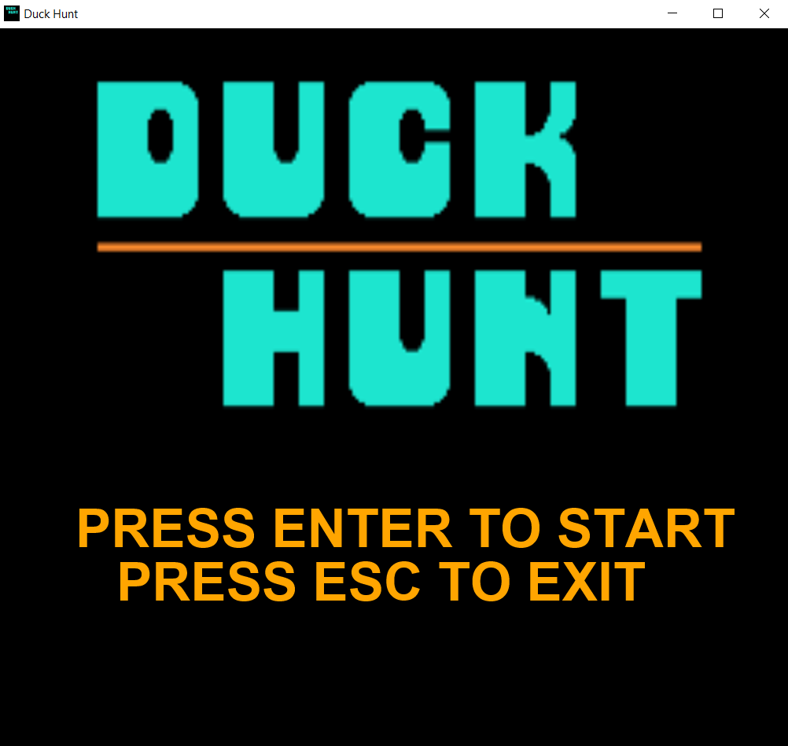
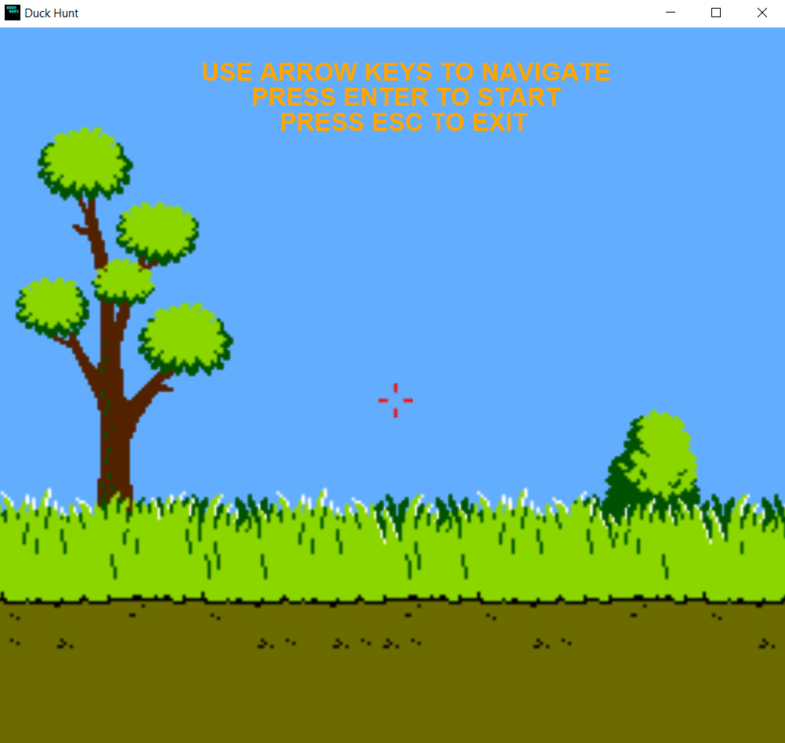
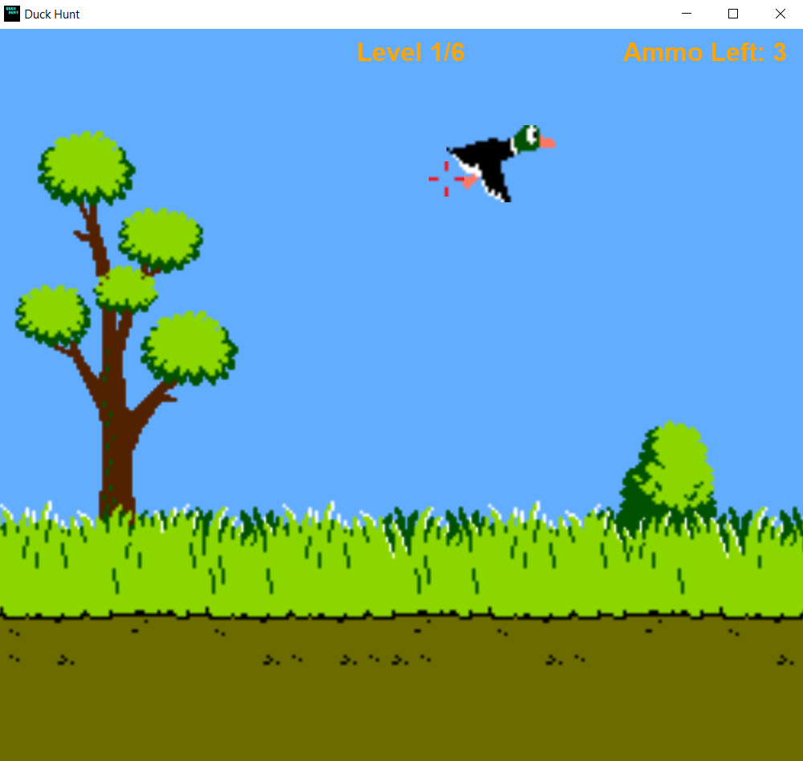
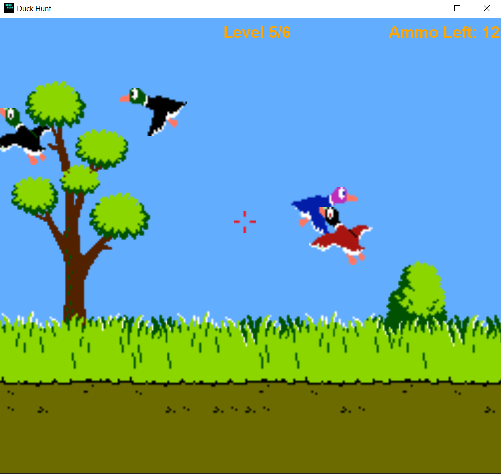

# JavaFX-DuckHunt

## In-game Photos







## Installation


#### On Windows:

1. Download and install Java SE Development Kit 8 (JDK 8) from the official Oracle website: [Oracle JDK 8](https://www.oracle.com/tr/java/technologies/javase/javase8-archive-downloads.html).
2. Configure the environment variables for `java.exe` and `javac.exe`.

-----------------------------------------------------------------------------------
#### On Linux (tested on Debian 12 "Bookworm"):

1. Download and extract the JDK 8 archive from the official Oracle website: [Oracle JDK 8](https://www.oracle.com/java/technologies/downloads/#java8).
2. Navigate to the extracted directory using the terminal: `cd jdk1.8.0_401/`.
3. Create a directory for the JDK installation: `mkdir /usr/lib/jvm/jdk1.8.0_401/`.
4. Move the contents of the extracted directory to the installation directory: `sudo mv * /usr/lib/jvm/jdk1.8.0_401/`.
5. Set up alternatives for Java and Java Compiler:
   ```bash
   sudo update-alternatives --install "/usr/bin/java" "java" "/usr/lib/jvm/jdk1.8.0_401/bin/java" 0
   sudo update-alternatives --install "/usr/bin/javac" "javac" "/usr/lib/jvm/jdk1.8.0_401/bin/javac" 0

   sudo update-alternatives --set java /usr/lib/jvm/jdk1.8.0_401/bin/java
   sudo update-alternatives --set java /usr/lib/jvm/jdk1.8.0_401/bin/java 
### Cross-platform Steps (Java 8 installation is required)
```bash
git clone https://github.com/samedokceci/JavaFX-DuckHunt.git
cd JavaFX-DuckHunt
javac *.java
java DuckHunt

